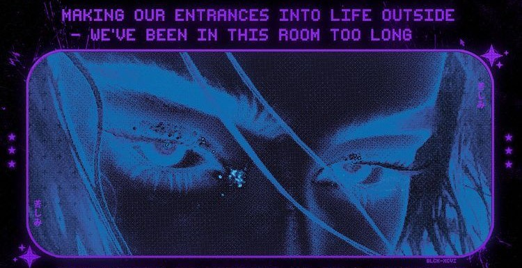

  

    
      

    
    
    
    
    
    
    

    

  

<h2 align="center"> <i>About Me</i></h2>

    <table width="95%" style="border-collapse: collapse; border: 0;">
        <tr>
            <td width="60%" align="left" style="padding-right: 20px; vertical-align: top; border: 0;">
                
I'm a Web3 Engineer and AI Developer focused on high-impact blockchain products and AI-augmented experiences. I ship secure smart-contract systems, performant dApps, and polished UIs with a strong emphasis on reliability, scalability, and developer ergonomics.

                
<h3> Web3 & AI Focus:</h3>
 

             
                    <strong>Chains:</strong> Solana, EVM (Ethereum + L2s), Sui, Hyperliquid, Bitcoin, XRP, MetaverseX
                

                

                     
                    <strong>Smart-contract languages:</strong> Rust, Move, Solidity
                

                

                     
                    <strong>Product areas:</strong> DeFi, DAO, Perpetuals, Launchpads, Gaming (P2E/NFT), Trading Infrastructure (on-chain agents, data pipelines, strategy automation, conversational tooling)
                

                

                     
                    <strong>AI/ML Tools:</strong> TensorFlow, PyTorch, Scikit-learn, Hugging Face, LangChain
                

            </td>

  <td width="40%" align="center" style="vertical-align: top; border: 0;">
                
                
    
                

                    
                

            </td>
        </tr>
    </table>

  

<h2 align="center">
     
    <i>Technologies</i>
</h2>

    
    
    
    
    
    
    
    
    
     
    
    
    
    
    
    

  
<!--

<h2 align="center">
     
    <i>Statistics</i>
</h2>

    
    
  

   

<h2 align="center">
     
    <i>Megha's Contribution Graph</i>
</h2>
<picture>
    <source media="(prefers-color-scheme: dark)" srcset="https://raw.githubusercontent.com/meghayay/meghayay/output/pacman-contribution-graph-dark.svg">
    <source media="(prefers-color-scheme: light)" srcset="https://raw.githubusercontent.com/meghayay/meghayay/output/pacman-contribution-graph.svg">
    
</picture>

 
-->
<b>借りてきた猫 </b>  
  

